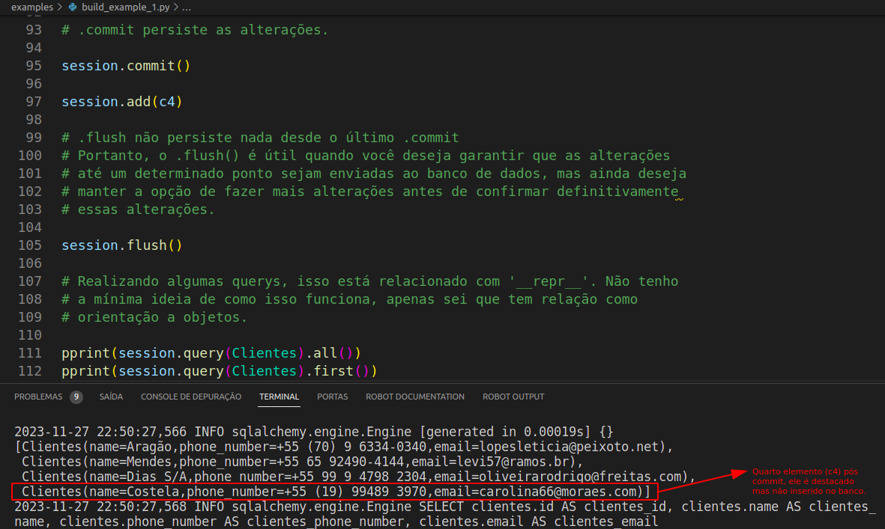
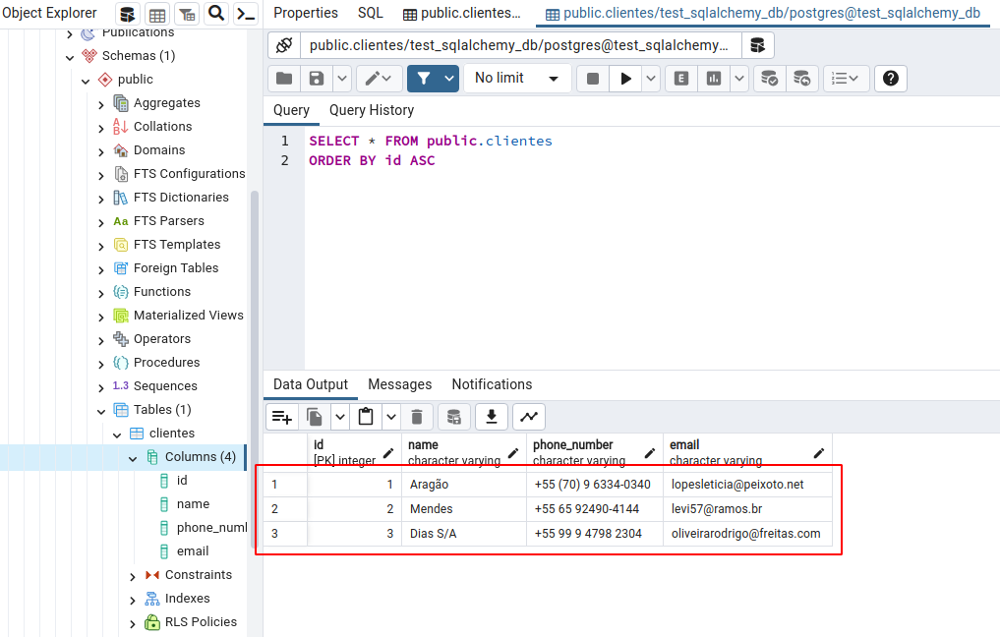

# Estudo de SQL Alchemy

 - ## O que é um ORM e que problemas ele resolve ?

ORM (Object-Relational Mapping) é uma técnica de programação que mapeia objetos definidos em código para tabelas em um banco de dados relacional. O principal objetivo do ORM é facilitar a interação entre código orientado a objetos e bancos de dados relacionais, abstraindo as complexidades da linguagem SQL e fornecendo uma interface mais intuitiva e orientada a objetos para interagir com os dados armazenados no banco.

O SQLAlchemy é um exemplo de biblioteca ORM para Python que permite aos desenvolvedores interagir com bancos de dados relacionais usando uma sintaxe Python mais familiar, em vez de escrever consultas SQL diretamente.

**"...uma forma de unir dois mundos. O mundo da progrmação orientada a objetos, ao mundo dos bancos de dados relacionais. "**

Podemos realizar diversar ações:

- Definir modelos de dados.
- Criação de tabelas e esquemas automaticamente.
- Consultar(Query's) e manipular dados.
- Relacionar tabelas.
- Crição de views.

**"...puristas criticam um pouco a utilização de ORM, pois as vezes geram códigos complexos, mas em um cenário que não conta com a participação de um DBA (Administrador de Banco de Dados) a utilização dessas ferramentas pode ser extremamente útil e evitar riscos."**

- ## Conceitos que não tinha conhecimento sobre (**"\_\_repr\_\_"**):


Em Python, **\_\_repr\_\_** é um método especial (também chamado de "método mágico") que você pode definir em suas classes para fornecer uma representação de string "não ambígua" do objeto. Esse método é chamado automaticamente quando a função repr() é aplicada a uma instância do objeto.


No contexto do SQLAlchemy, o método `__repr__` é frequentemente utilizado para personalizar a representação de string de suas classes de modelo, tornando a saída mais legível e informativa ao inspecionar objetos durante o desenvolvimento, depuração ou interação com o console interativo.

No código, a classe `Clientes` possui um método `__repr__` implementado. Aqui está o trecho relevante:


**build_example_1.py**

```python
class Clientes(Base):
    # ... (definição de colunas omitida)

    def __repr__(self):
        return (
            f'Clientes(name={self.name}, '
            f'phone_number={self.phone_number}, '
            f'email={self.email})'
        )
```

Explicando o que está acontecendo:

- **`def __repr__(self):`**: Isso é uma implementação do método `__repr__` específico para a classe `Clientes`. Este método é chamado automaticamente quando a função `repr()` é aplicada a uma instância da classe `Clientes`.

- **`return f'Clientes(name={self.name}, ...'`**: Aqui, você está retornando uma string formatada que representa a instância da classe `Clientes`. Cada atributo da instância (`name`, `phone_number`, `email`) é incluído na string, proporcionando uma representação legível.

- **Finalidade**: A finalidade de implementar `__repr__` neste contexto é que, quando você chama `repr(instancia_cliente)`, onde `instancia_cliente` é uma instância da classe `Clientes`, a saída será algo como `Clientes(name=nome, phone_number=numero_telefone, email=email)`.

Quando você realiza consultas e imprime os resultados, como no final do seu código:

**build_example_1.py**

```python
pprint(session.query(Clientes).all())
pprint(session.query(Clientes).first())
```

A função `pprint` utiliza o método `__repr__` para formatar a saída de maneira mais legível. Sem o `__repr__` personalizado, a saída padrão seria menos informativa e mais difícil de interpretar ao inspecionar objetos SQLAlchemy.

No Python, o método `__repr__` é chamado automaticamente quando você tenta imprimir uma instância de uma classe, mesmo sem explicitamente usar a função `repr()`. Isso acontece porque o Python tenta fornecer uma representação de string útil para objetos quando eles são usados em contextos nos quais uma string é esperada, como quando você os imprime com a função `print()`.

Se o método `__repr__` estiver implementado em uma classe, ele será chamado automaticamente quando você usar a função `print()` ou qualquer outra situação em que a representação de string do objeto seja necessária. Portanto, você não precisa chamar `repr()` explicitamente.

Então, quando você imprime os resultados de suas consultas SQLAlchemy, o método `__repr__` personalizado é automaticamente invocado para fornecer uma saída mais informativa e legível. Isso torna a depuração e a visualização de dados mais convenientes durante o desenvolvimento.

Em resumo, `__repr__` é uma ferramenta útil no SQLAlchemy para melhorar a legibilidade e a utilidade ao trabalhar com objetos de modelo em seu código.

- ## Confirmando alterações com '.commit' e o efeito com '.flush'

Note abaixo que apenas as adições realizadas antes do **'.commit'** são confirmadas no banco.



Apesar de **"c4"** retornar na query ele não é regitrado no banco.


